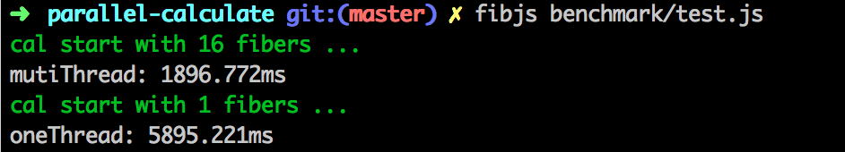

# parallel-calculate
 Yeah! That's right. MutiThread JS for fast calculation.

# Benchmark


# Usage
```js
const Calculator = require('parallel-calculate');
const calculator = new Calculator('path to cal.js');
let result = calculator.proxy([1,2,3], 'plus');
```

# test

```
fibjs test/index.test.js
```

# Attendtion
- You can only use this lib on [fibjs](https://github.com/xicilion/fibjs).It does not support Node.js.
